# 🛍️ FashionStore Frontend - Website bán hàng thời trang

**Chủ sở hữu:** [Hieuvolaptrinh](https://github.com/hieuvolaptrinh)

## 📝 Mô tả dự án:

**FashionStore** là website bán hàng thời trang trực tuyến hiện đại với đầy đủ tính năng từ mua sắm cho khách hàng đến quản lý toàn diện cho admin. Hệ thống được xây dựng với kiến trúc frontend-backend riêng biệt, đảm bảo hiệu suất cao và khả năng mở rộng tốt.

### 🎯 Tính năng chính:

#### 👥 Dành cho khách hàng:

- **Đăng ký/Đăng nhập:** Hệ thống xác thực an toàn với email verification
- **Mua sắm trực tuyến:** Duyệt sản phẩm theo danh mục, tìm kiếm, lọc sản phẩm
- **Giỏ hàng thông minh:** Quản lý sản phẩm, cập nhật số lượng, tính toán tự động
- **Thanh toán đa dạng:** Hỗ trợ VNPAY, thanh toán trực tiếp
- **Quản lý đơn hàng:** Theo dõi trạng thái đơn hàng, lịch sử mua hàng
- **Đánh giá sản phẩm:** Viết review, xem đánh giá từ khách hàng khác
- **Quản lý tài khoản:** Cập nhật thông tin cá nhân, đổi mật khẩu

#### 🔧 Dành cho Admin:

- **Dashboard:** Tổng quan doanh thu, thống kê chi tiết
- **Quản lý sản phẩm:** Thêm, sửa, xóa, kích hoạt/vô hiệu hóa sản phẩm
- **Quản lý đơn hàng:** Xử lý đơn hàng, cập nhật trạng thái giao hàng
- **Quản lý voucher:** Tạo, cập nhật mã giảm giá
- **Quản lý người dùng:** Quản lý tài khoản khách hàng và shipper
- **Hệ thống rút tiền:** Xử lý yêu cầu rút tiền, lịch sử giao dịch
- **Báo cáo doanh thu:** Thống kê chi tiết theo thời gian

#### 🚚 Dành cho Shipper:

- **Quản lý đơn hàng:** Nhận và xử lý đơn hàng được phân công
- **Theo dõi giao hàng:** Cập nhật trạng thái giao hàng

## 💻 Công nghệ sử dụng:

### **Frontend:**

- **React 18:** Framework chính để xây dựng giao diện người dùng hiện đại
- **TypeScript:** Đảm bảo an toàn về kiểu dữ liệu và tăng tính bảo trì
- **Bootstrap 5:** Framework CSS responsive design
- **Material-UI (MUI):** Thư viện component UI đẹp và chuyên nghiệp
- **React Router:** Quản lý định tuyến SPA
- **Axios:** HTTP client để gọi API
- **React Hook Form:** Quản lý form hiệu quả
- **React Query:** Quản lý state server và caching

### **Backend:**

- **Java Spring Boot 3:** Framework backend chính
- **Spring Security 6:** Quản lý authentication và authorization
- **Spring Data JPA:** ORM và quản lý database
- **Spring Mail:** Gửi email tự động
- **SQL Server:** Cơ sở dữ liệu chính
- **JWT (JSON Web Token):** Token-based authentication
- **BCrypt:** Mã hóa mật khẩu
- **Jackson:** JSON serialization/deserialization

### **Payment Integration:**

- **VNPAY API:** Cổng thanh toán trực tuyến
- **RESTful API:** Kiến trúc API chuẩn

### **Tools & DevOps:**

- **Vite:** Build tool và dev server nhanh
- **ESLint & Prettier:** Code formatting và linting
- **Postman:** API testing và documentation
- **Git & GitHub:** Version control và collaboration
- **Docker:** Containerization (planned)

## 🚀 Cài đặt và sử dụng:

### ⚙️ Yêu cầu hệ thống:

- **Node.js:** >= 18.x
- **npm:** >= 8.x (hoặc yarn >= 1.22.x)
- **Trình duyệt:** Chrome, Firefox, Safari (phiên bản mới nhất)
- **RAM:** Tối thiểu 4GB
- **Dung lượng:** 500MB trống

### 📦 Cài đặt dự án:

1. **Clone repository:**

   ```bash
   git clone https://github.com/hieuvolaptrinh/FashionStore_FrontEnd.git
   cd FashionStore_FrontEnd
   ```

2. **Cài đặt dependencies:**

   ```bash
   npm install
   # hoặc
   yarn install
   ```

3. **Cấu hình environment:**

   ```bash
   # Tạo file .env.local
   cp .env.example .env.local

   # Cập nhật các biến môi trường
   VITE_API_BASE_URL=http://localhost:8080/api
   VITE_VNPAY_URL=https://sandbox.vnpayment.vn
   ```

4. **Chạy ứng dụng:**

   ```bash
   # Development mode
   npm run dev

   # Production build
   npm run build
   npm run preview
   ```

5. **Truy cập ứng dụng:**
   - Development: `http://localhost:5173`
   - Production: Theo cấu hình server

## 📸 Giao diện ứng dụng:

### 🔐 Xác thực và Bảo mật

#### Đăng nhập

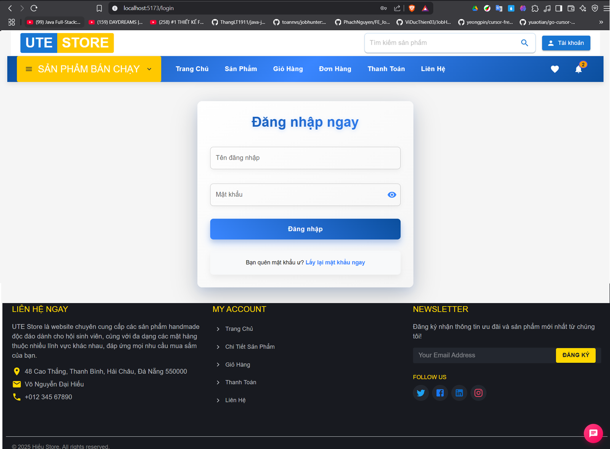

#### Đăng ký tài khoản

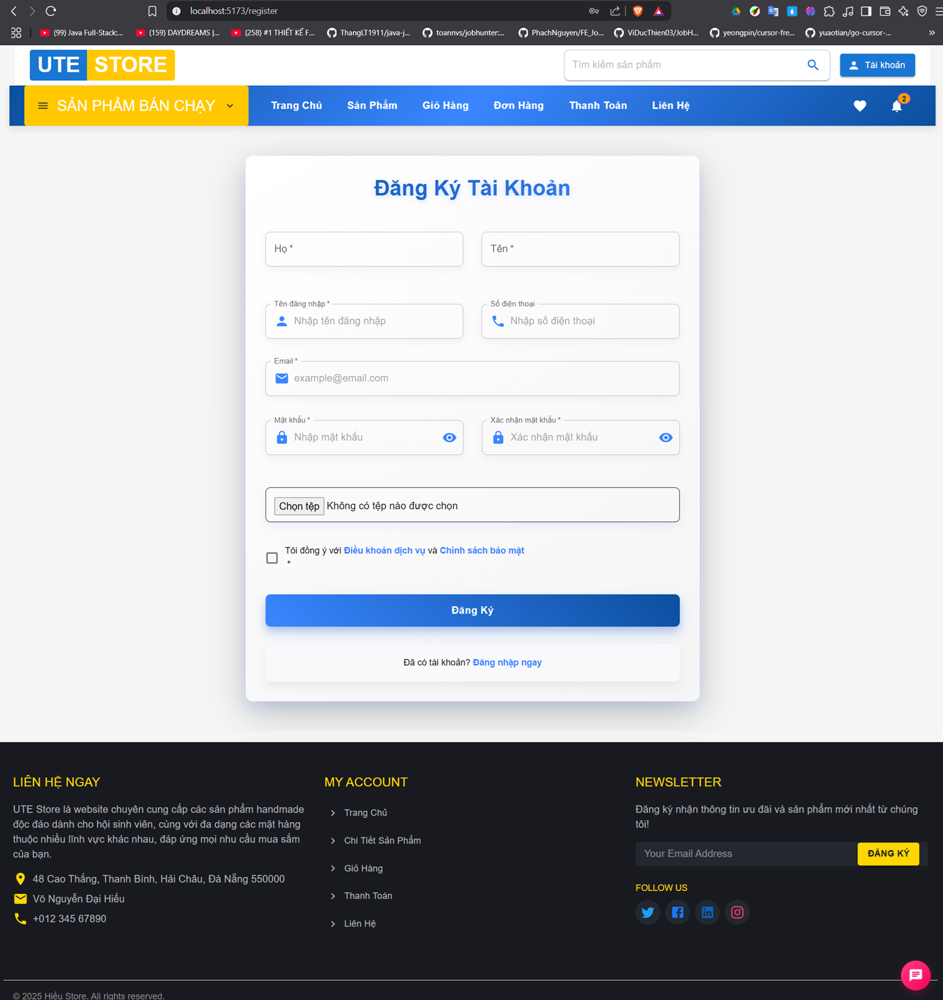

#### Quên mật khẩu

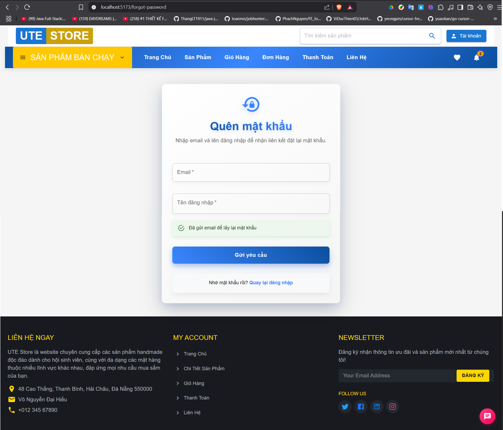

#### Đặt lại mật khẩu

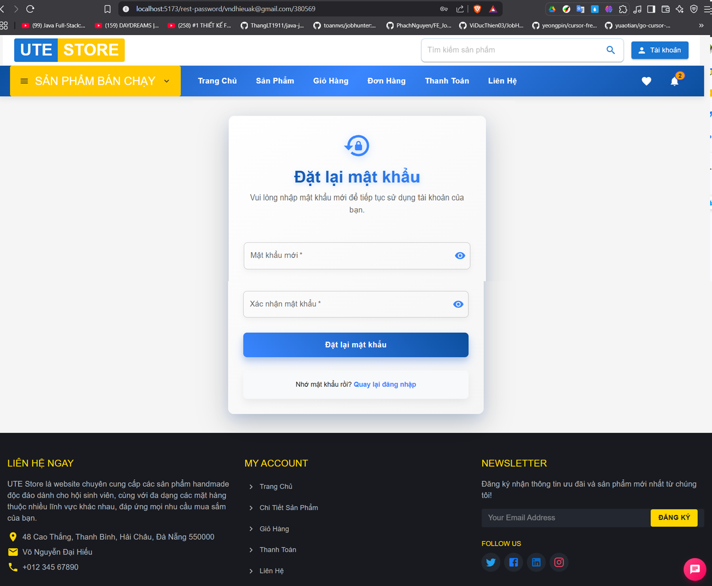

#### Email đăng ký tài khoản


#### Email lấy lại mật khẩu


#### Kích hoạt tài khoản thành công


### 🛒 Giao diện khách hàng

#### Trang chủ sản phẩm

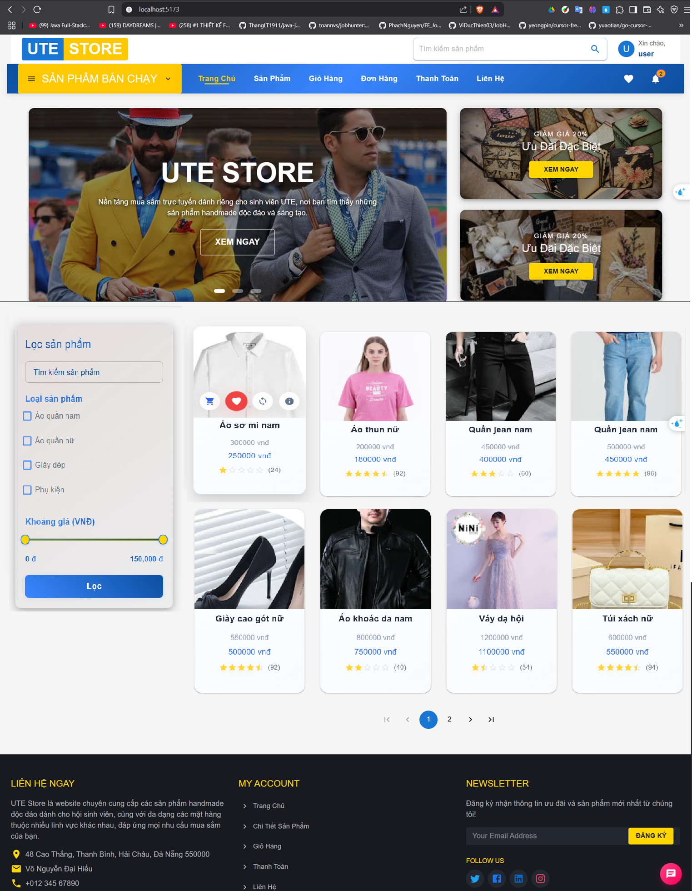

#### Chi tiết sản phẩm


#### Mô tả sản phẩm


#### Đánh giá sản phẩm


#### Giỏ hàng


### 💳 Thanh toán

#### Thanh toán đơn hàng


#### Thanh toán trực tiếp

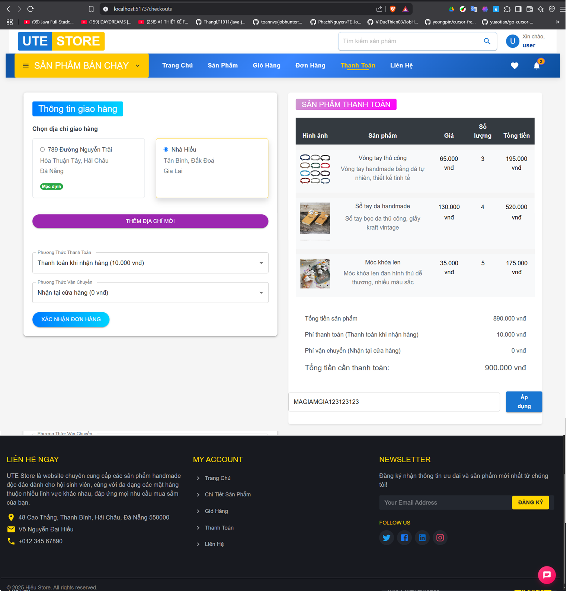

#### Thanh toán qua VNPAY


#### Thanh toán thành công


#### Thanh toán thất bại

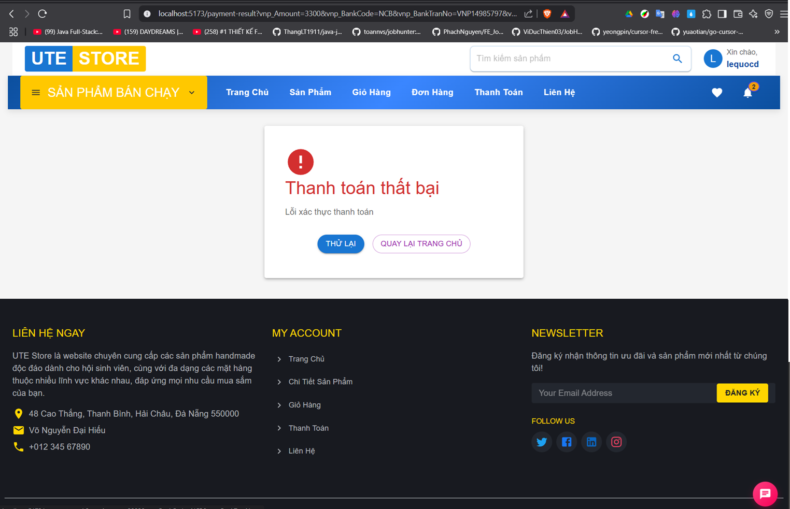

### 👤 Quản lý tài khoản

#### Thông tin cá nhân


#### Chỉnh sửa thông tin cá nhân


#### Chỉnh sửa thông tin người dùng


#### Danh sách đơn hàng


#### Xem thông báo


### 🚚 Giao diện Shipper

#### Danh sách đơn hàng đã nhận


#### Lịch sử nhận tiền

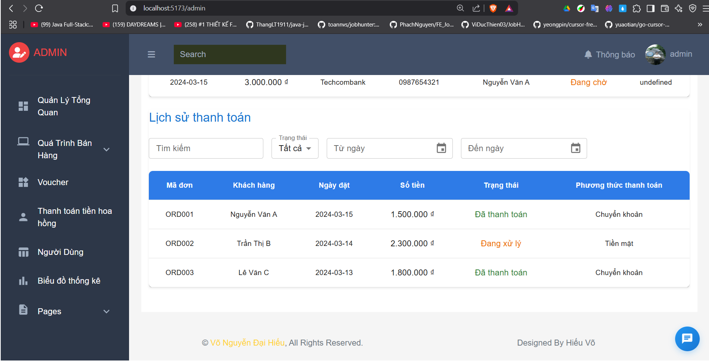

### 🔧 Giao diện Admin

#### Tổng quan doanh thu


#### Doanh thu chi tiết


#### Quản lý sản phẩm

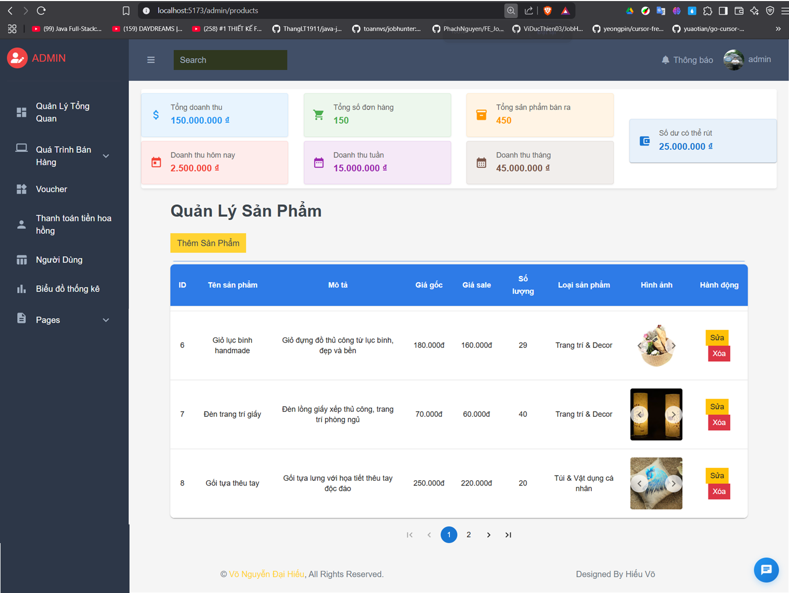

#### Sửa thông tin sản phẩm


#### Đang bán sản phẩm

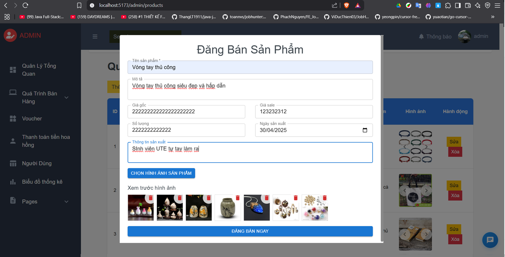

#### Kích hoạt sản phẩm thất bại


#### Trả sản phẩm


#### Quản lý đơn hàng (Admin)


#### Danh sách voucher


#### Cập nhật voucher


#### Danh sách người dùng

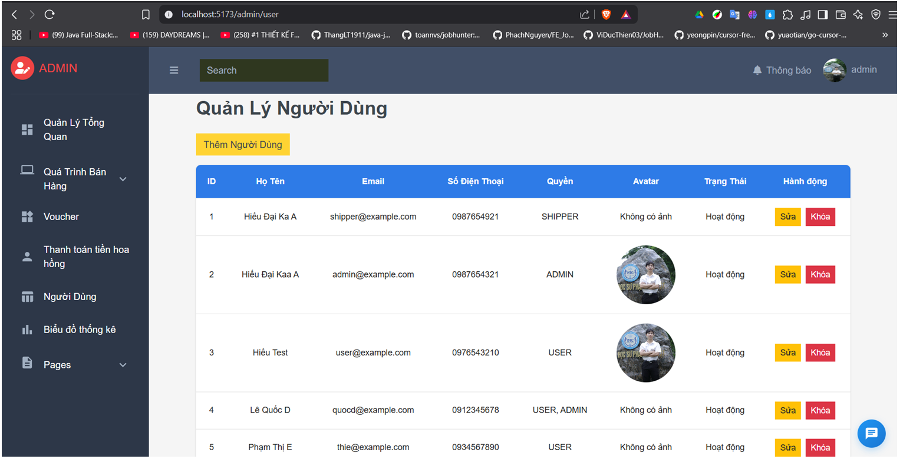

#### Rút tiền


#### Lịch sử rút tiền


### 🗂️ ERD Database


## 🏗️ Cấu trúc dự án:

```
FashionStore-FrontEnd/
├── public/                    # Static assets
│   ├── images/               # Product images
│   └── vite.svg             # Vite logo
├── src/
│   ├── components/          # Reusable components
│   │   ├── Admin/          # Admin-specific components
│   │   ├── Client/         # Client-specific components
│   │   └── Shipper/        # Shipper-specific components
│   ├── contexts/           # React contexts
│   ├── hooks/              # Custom hooks
│   ├── layouts/            # Layout components
│   │   ├── Admin/          # Admin layout
│   │   └── Client/         # Client layout
│   ├── models/             # TypeScript interfaces
│   ├── pages/              # Page components
│   │   ├── Admin/          # Admin pages
│   │   ├── Client/         # Client pages
│   │   └── Shipper/        # Shipper pages
│   ├── routes/             # Route configurations
│   ├── service/            # API services
│   │   └── API/            # API endpoints
│   ├── utils/              # Utility functions
│   └── assets/             # Stylesheets and resources
├── preview/                # Screenshots for README
└── package.json           # Dependencies and scripts
```

## 🚀 Tính năng nổi bật:

### 🔒 Bảo mật cao:

- JWT token authentication
- Bcrypt password hashing
- Email verification
- Role-based access control
- CORS protection

### 📱 Responsive Design:

- Mobile-first approach
- Bootstrap 5 responsive grid
- Cross-browser compatibility
- Touch-friendly interface

### ⚡ Hiệu suất tối ưu:

- React 18 với Concurrent Features
- Lazy loading components
- Image optimization
- API response caching
- Code splitting

### 🔄 Real-time Updates:

- Order status tracking
- Live notifications
- Inventory updates
- Payment status

## 🛠️ Scripts có sẵn:

```bash
# Development
npm run dev          # Chạy development server
npm run build        # Build production
npm run preview      # Preview production build
npm run lint         # Chạy ESLint
npm run lint:fix     # Fix ESLint errors
npm run type-check   # TypeScript type checking
```

## 🔗 Liên kết quan trọng:

- **Frontend Repository:** [FashionStore_FrontEnd](https://github.com/hieuvolaptrinh/FashionStore_FrontEnd)
- **Backend Repository:** [FashionStore_BackEnd](https://github.com/hieuvolaptrinh/FashionStore_BackEnd)
- **Live Demo:** [Coming Soon]
- **API Documentation:** [Postman Collection](link-to-postman)

## 📋 Roadmap:

### ✅ Completed:

- [x] User authentication & authorization
- [x] Product catalog with search & filter
- [x] Shopping cart functionality
- [x] Order management system
- [x] Payment integration (VNPAY)
- [x] Admin dashboard
- [x] Responsive design
- [x] Email notifications

### 🔄 In Progress:

- [ ] Real-time chat support
- [ ] Advanced analytics
- [ ] Mobile app (React Native)
- [ ] Performance optimization

### 📅 Planned:

- [ ] Multi-language support
- [ ] PWA features
- [ ] Social media integration
- [ ] Advanced recommendation system
- [ ] Inventory forecasting

## 🤝 Đóng góp:

Chúng tôi luôn chào đón các đóng góp từ cộng đồng!

### Cách đóng góp:

1. Fork repository
2. Tạo feature branch (`git checkout -b feature/AmazingFeature`)
3. Commit changes (`git commit -m 'Add some AmazingFeature'`)
4. Push to branch (`git push origin feature/AmazingFeature`)
5. Tạo Pull Request

### Quy tắc đóng góp:

- Tuân thủ coding standards
- Viết unit tests cho tính năng mới
- Cập nhật documentation
- Follow commit message convention

## 📄 License:

Dự án này được phân phối dưới giấy phép MIT. Xem file `LICENSE` để biết thêm chi tiết.

## 📞 Liên hệ:

- **Developer:** Hieuvolaptrinh
- **Email:** [your-email@example.com]
- **GitHub:** [@hieuvolaptrinh](https://github.com/hieuvolaptrinh)
- **LinkedIn:** [Your LinkedIn Profile]

## 🙏 Acknowledgments:

- Cảm ơn [React Team](https://reactjs.org/) vì framework tuyệt vời
- Cảm ơn [Spring Boot](https://spring.io/projects/spring-boot) vì backend framework mạnh mẽ
- Cảm ơn [VNPAY](https://vnpay.vn/) vì payment gateway
- Cảm ơn cộng đồng open source vì các thư viện hữu ích

---

⭐ **Nếu dự án này hữu ích, hãy cho một Star để ủng hộ chúng tôi!** ⭐
